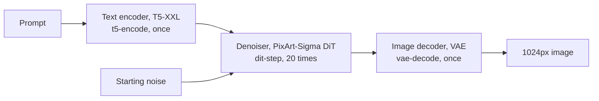
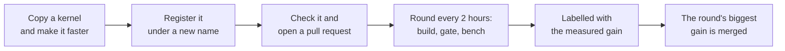

# Burnisher

**A native C++/CUDA text-to-image runtime for consumer Blackwell GPUs, made faster by an open,
measured and paid competition.**

Burnisher turns a text prompt into a 1024px image with PixArt-Sigma, on cuBLAS and cuDNN, with no
Python in the runtime. Anyone can submit a faster kernel. An evaluator measures it on the pinned RTX
5090, checks that it is still correct, and pays for the share of the remaining gap to the hardware's
limit that it closes.


- [Where it stands](#where-it-stands)
- [How it works](#how-it-works)
- [Quick start](#quick-start)
- [Mining: how to earn](#mining-how-to-earn)
- [How a change is scored](#how-a-change-is-scored)
- [Documents](#documents)
- [Repository layout](#repository-layout)

## Where it stands

Measured on an RTX 5090 at 1024px in bf16, against PyTorch (diffusers, eager) on the same card
([`eval/cells/BG-1/pytorch-baseline.json`](eval/cells/BG-1/pytorch-baseline.json)). PyTorch makes
the whole image in **1.92 s**.

| stage | runs per image | share of its ceiling reached | time against PyTorch |
|:--|--:|--:|--:|
| `t5-encode`, the text encoder | 1 | 68.7% | **0.9×**, faster |
| `dit-step`, one denoising step | 20 | 55.6% | **1.1×** |
| `vae-decode`, the image decoder | 1 | 25.4% | **1.4×** |

- **Correct.** It passes the fp32 [correctness gate](docs/CORRECTNESS.md) against committed
  reference latents, and every replay is byte-identical.
- **Room left.** Every stage still has a measurable gap to its ceiling, and closing it is what is
  paid.

Everything measured, and everything still unknown: [`docs/STATUS.md`](docs/STATUS.md).

## How it works



- **Every operation is a registered kernel.** A model is a graph of 15 ops (GEMM, attention, norm,
  convolution and 11 more), and each op has named implementations side by side in one binary:
  `stock` on the CPU, `cuda` on the GPU, and any number of contributed ones.
- **The CPU kernels are the oracle.** They are written to be correct, and every GPU kernel is
  checked against them and against the reference implementation.
- **A cell** is one stage at one shape and dtype, such as `dit-step/1024/bf16`. Its **ceiling** is
  arithmetic: the fastest the card's measured compute and memory speed allow
  ([`docs/ROOFLINE.md`](docs/ROOFLINE.md)).
- **A generation** freezes a set of cells, prompts and reference latents, so a score always means the
  same thing: [BG-1](eval/cells/BG-1/) at 1024px, [BG-2](eval/cells/BG-2/) at 512px.

## Quick start

### Requirements

| to | you need |
|:--|:--|
| build, test and submit | a C++17 compiler, CMake 3.24 or newer, Python 3 with NumPy. No GPU. |
| compile the CUDA runtime | the CUDA toolkit and cuDNN 9 (`libcudnn9-dev-cuda-<major>`) |
| run and measure on a GPU | an RTX 5090 |
| make images | the checkpoint (about 22 GB) and the `sentencepiece` Python package |

### 1. Build and check, no GPU

```bash
scripts/build.sh              # CPU build: the correctness oracle and the whole harness
./build/burnisher selftest    # run the whole graph on synthetic weights
scripts/check.sh              # every check that needs no GPU
```

### 2. Get the checkpoint

The revisions are pinned in [`eval/cells/BG-1/generation.json`](eval/cells/BG-1/generation.json), so
everyone runs the same weights.

```bash
pip install huggingface_hub
python3 - <<'PY'
import json
from huggingface_hub import snapshot_download
m = json.load(open("eval/cells/BG-1/generation.json"))["model"]
snapshot_download(m["repo"], revision=m["revision"],
                  allow_patterns=["transformer/*", "vae/*"], local_dir="weights")
snapshot_download(m["text_encoder_repo"], revision=m["text_encoder_revision"],
                  allow_patterns=["text_encoder/*", "tokenizer/*"], local_dir="weights")
PY
```

### 3. Make an image, on a GPU

```bash
scripts/build_cuda.sh
pip install sentencepiece
scripts/generate.py --weights weights "a red fox asleep in fresh snow" --out fox.png
```

Commands that produce a measurement (`tools/burnish probe | calibrate | gate | bench`) refuse to run
without a GPU. They never estimate.

## Mining: how to earn

Gittensor SN74 pays merged pull requests that carry a bot-verified speedup, and Burnisher is being
built to be scored there.



1. **Pick the work.** `tools/burnish roofline` shows every cell's ceiling, how full it is and its
   time against PyTorch. [`issues/README.md`](issues/README.md) lists the open work, each item with
   its arithmetic.
2. **Write your kernel beside the old one.** Copy the kernel you want to beat, change the copy, and
   register it under a new name:

   ```cpp
   register_impl<AttentionArgs>("attention", "flash-sm120", my_attention, "what changed");
   ```

   Never edit an existing kernel in place. The validator measures your new name against `cuda` in
   the same binary, and an edited kernel has nothing to be measured against.
3. **Check it.** [`scripts/check.sh`](scripts/check.sh) needs no GPU.
   [`scripts/differential_test.py`](scripts/differential_test.py) compares one stage with the
   reference implementation.
4. **Open a pull request** and fill in the [template](.github/PULL_REQUEST_TEMPLATE.md). Write your
   kernel's name on its `Implementation name` line.
5. **Get measured.** Every two hours the evaluator scores up to twelve pull requests, oldest first. A
   paid result is labelled `burnish:gap+N.NNNN`, and the round's biggest gain is merged. Every
   label: [`docs/EVAL.md`](docs/EVAL.md#labels).

More ways in:

- **Quantization.** Read [`issues/weight-formats.md`](issues/weight-formats.md) first: one DiT step
  costs 0.473 s at fp32 and 0.098 s at bf16, and the fp8 and NVFP4 cells have no implementation yet.
- **A new cell,** such as a new resolution or model, is paid too:
  [`docs/CARTOGRAPHY.md`](docs/CARTOGRAPHY.md).

The full guide, step by step: [`CONTRIBUTING.md`](CONTRIBUTING.md).

## How a change is scored

```
a = ceiling / measured                       how close a cell is to its ceiling, 0 to 1
g = (a_candidate - a_base) / (1 - a_base)    the share of the remaining gap you closed
```

- **Paired, not absolute.** Base and candidate run alternately in one binary, so any card of the
  pinned class gives the same score.
- **Above the noise only.** Each cell's noise floor is measured by running the base against itself.
  A gain counts only when its 99% interval clears that floor, and a regression that clears it counts
  against you.
- **Correct first.** A change that fails the fp32 correctness gate, or does not replay byte for byte,
  is rejected before anything is timed.
- **No shortcuts.** A held-out resolution, drawn after your code is frozen, catches kernels tuned to
  one shape. A speedup bought with more memory or less fidelity than it is worth pays nothing.
- **Anyone can check.** `tools/burnish audit` re-derives any verdict from its published measurements
  in about two seconds, with no GPU. A real one is in [`examples/`](examples/README.md).

Worked through, with examples: [`docs/SCORING.md`](docs/SCORING.md).

## Documents

| document | read it to |
|:--|:--|
| [`CONTRIBUTING.md`](CONTRIBUTING.md) | pick, write, check and submit a kernel |
| [`docs/SCORING.md`](docs/SCORING.md) | understand how the number is computed |
| [`docs/EVAL.md`](docs/EVAL.md) | follow a pull request through evaluation, read its label, or run a validator |
| [`docs/CORRECTNESS.md`](docs/CORRECTNESS.md) | know what the correctness gate checks |
| [`docs/CARTOGRAPHY.md`](docs/CARTOGRAPHY.md) | add a new cell |
| [`docs/STATUS.md`](docs/STATUS.md) | see what is measured and what is not |
| [`docs/ROOFLINE.md`](docs/ROOFLINE.md) | see every cell's ceiling (generated) |
| [`issues/README.md`](issues/README.md) | find open work |

## Repository layout

| path | what is there |
|:--|:--|
| [`include/burnisher/`](include/burnisher/) | tensor, dtype, op registry, models, scheduler, pipeline |
| [`src/cpu/`](src/cpu/) | reference ops: the correctness oracle, not the product |
| [`src/cuda/`](src/cuda/) | the CUDA op backend and the device probe |
| [`src/models/`](src/models/) | T5 encoder, PixArt DiT and VAE decoder, as graphs over the registry |
| [`tools/`](tools/) | the `burnisher` binary's entry point and the `burnish` harness CLI |
| [`eval/burnscore/`](eval/burnscore/) | the scorer: geometry, roofline, floor, bootstrap, frontier, receipt, ledger |
| [`eval/cells/`](eval/cells/) | frozen generations: definition, anchor, prompts, reference latents |
| [`scripts/`](scripts/) | build, check, generate, and the correctness and measurement tools |
| [`issues/`](issues/README.md) | the backlog, generated from `configs/` |
| [`examples/`](examples/README.md) | one real scoring run, re-scorable with no GPU |

## Licence

Apache-2.0. The pinned PixArt-Sigma checkpoint (CreativeML Open RAIL++-M) and its T5-XXL encoder
(Apache-2.0) are both ungated, so anyone can re-run the benchmark.
